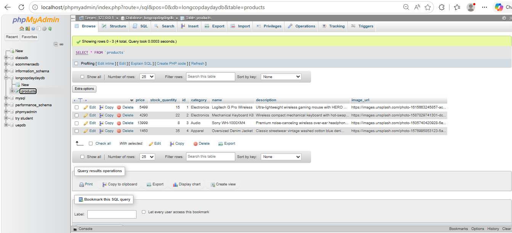
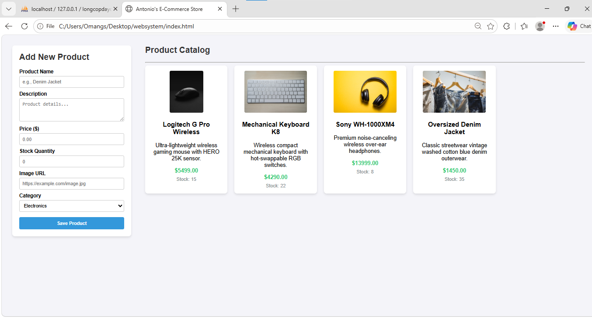

# 🛒 TechStore E-Commerce Project (LABORATORY 8)

---

## 📝 Project Overview
This project represents the advanced data-driven phase of the **TechStore E-Commerce REST API**, satisfying the academic criteria for **WS101 (Web Systems and Technologies)**. Shifting away from the transient in-memory arrays utilized in Laboratory 7, this release establishes a live, production-grade relational persistence engine via **Spring Data JPA and a local MySQL Server**. 

Additionally, the system features a unified responsive frontend web dashboard that dynamically pulls catalog data streams and propagates newly created products down into the persistent physical disk layers via asynchronous JavaScript **Fetch API (`async/await`) pipelines**.

---

## 🚀 1. Technology Stack Configuration
The full-stack architecture is powered by the following core technical ecosystem tools:
* **Backend Framework:** Spring Boot 3.x (Web, Validation, and Data JPA Starters)
* **Object-Relational Mapping (ORM):** Hibernate Core Engine
* **Database Management System:** MySQL Server 8.x
* **Frontend Web Components:** Semantic HTML5, Embedded Custom CSS Grid Architecture
* **Client Scripting Engine:** Native Vanilla JavaScript (Asynchronous Promises & Fetch Stream Interfaces)
* **Build Optimization & VCS:** Gradle (Groovy DSL) & Distributed Git Pipeline Management

---

## 📊 2. Relational Database Schema Architecture
The relational persistence layout relies on an automated structural table generation mechanism configured within the Hibernate runtime framework:

### 🗄️ Table Directory Summary: `products`
* **`id`** (BIGINT, Primary Key): Unique row identifier pointer configured with an auto-incrementing serial sequencer (`GenerationType.IDENTITY`).
* **`name`** (VARCHAR(100), Not Null): The primary alphanumeric identification string representing the tech product name.
* **`description`** (TEXT, Not Null): Unbounded text block accommodating long structural product information overviews.
* **`price`** (DOUBLE, Not Null): Financial evaluation metric. (*Constraint: Absolute positive floating value greater than zero*).
* **`category`** (VARCHAR(50), Not Null): Flat categorical string grouping tags used for query classification lookups.
* **`stock_quantity`** (INT, Not Null): Physical item count monitoring. (*Constraint: Floor limit locked at zero via `@Min(0)`*).
* **`image_url`** (VARCHAR(255), Nullable): Public network link string pointing to host asset images.

---

## 🔌 3. API Endpoints Matrix

The following table serves as the updated backend route map, now driven entirely by transactional database repository interfaces:

| HTTP Method | API Endpoint Route | Required Payload Body | Access Scope | Expected Success Status | Operational Purpose |
| :--- | :--- | :--- | :--- | :--- | :--- |
| **GET** | `/api/v1/products` | None | Public | `200 OK` | Queries and fetches all product rows stored in the MySQL products table. |
| **GET** | `/api/v1/products/{id}` | None | Public | `200 OK` / `404 Not Found` | Extracts a single product entity matching the precise primary key ID pointer. |
| **GET** | `/api/v1/products/filter` | Query String (`?category=value`) | Public | `200 OK` | Filters database records dynamically matching case-insensitive category fields. |
| **POST** | `/api/v1/products` | Product JSON Object | Public | `201 Created` / `400 Bad Request` | Validates data contracts and logs a brand new product row entry into the database. |
| **PUT** | `/api/v1/products/{id}` | Product JSON Object | Public | `200 OK` / `404 Not Found` | Resolves an active ID index record and overwrites its matching properties. |
| **DELETE** | `/api/v1/products/{id}` | None | Public | `204 No Content` / `404 Not Found` | Completely purges a targeted product entity record row out of database disk storage. |

---

## 🛠️ 4. Comprehensive Task-by-Task Implementation Trace

### Task 8: Database Integration & Asynchronous Fetch Script Configuration
* **Part 1: Branch Isolation & Environment Setup:** Created a dedicated development feature track (`feat/db-integration`), loaded the `spring-boot-starter-data-jpa` and `mysql-connector-j` dependency libraries into `build.gradle`, and configured standard connectivity parameters inside `application.properties`.
* **Part 2: Model Refactoring:** Restructured `Product.java` into an active persistence entity annotated with `@Entity` and `@Table(name = "products")`, shifting the lookup primary key type from a volatile `String` to a database-compliant auto-incrementing `Long`.
* **Part 3: Repository Generation:** Created `ProductRepository.java` extending `JpaRepository` to provide abstract data access without writing raw manual SQL statements.
* **Part 4: Business Logic Transformation:** Refactored `ProductService.java` to drive CRUD routines directly using built-in repository query mechanisms.
* **Part 5: Controller Alignment:** Updated `ProductController.java` to accept numeric primary key indices matching the new `Long` data model requirements.
* **Part 6: Resolving CORS Constraints:** Applied an explicit `@CrossOrigin` config interceptor targeting origin port boundaries (`http://localhost:5500`) to enable secure full-stack script access and prevent cross-origin resource blockages (`VCS: iss1: Resolved CORS error.`).
* **Part 7: Full-Stack Fetch Integration:** Engineered a unified client dashboard (`index.html`) using robust asynchronous JavaScript modules (`async/await` and `.json()` streams) wrapped inside explicit diagnostic `try/catch` exception error log blocks to load and submit live store items smoothly.

---

## 📸 5. Laboratory Evidence of Success

### Relational Database Table Rows (MySQL Workbench / DBeaver)


### Asynchronous Network Pipeline Log (Browser Developer Console)


---

## ⚙️ 6. Local Workspace Launch Directives

Run these command profiles sequentially within your environment terminal container to compile and run the full-stack system:
```bash
# 1. Access the local directory and build the Java application package
./gradlew clean compileJava

# 2. Boot up the embedded Tomcat web server environment
./gradlew bootRun

# 3. Access the persistent store application UI via your web browser
# Navigate to: http://localhost:8080/index.html
